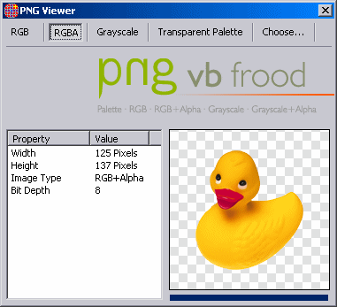



## PNG View

### Description

This code allows you to display PNG images within your programs with full 32 bit color (that is, 24 bit color with 8 bit alpha transparency). This will allow you to use "anti-aliased" images in your programs, making your graphics blend in to the interface perfectly, no matter what color the user has chosen for their interface. Code by Thomas Kabir (www.VBFrood.de). Posted here with permission. Requires ZLib for Windows and you must compile and register and re-reference the ActiveX DLL before attempting to use this. I've tried to include a compiled OCX and DLL, as well as a workling zlib.dll, but PSC won't let me. If VB won't compile correctly and\or you need any of them, email me.
 
### More Info
 

             |
---                |---
**Submitted On**   |2000-07-25 02:31:52
**By**             |[Andrew Saturn](https://github.com/Planet-Source-Code/PSCIndex/blob/master/ByAuthor/andrew-saturn.md)
**Level**          |Advanced
**User Rating**    |4.5 (18 globes from 4 users)
**Compatibility**  |VB 6\.0
**Category**       |[Graphics](https://github.com/Planet-Source-Code/PSCIndex/blob/master/ByCategory/graphics__1-46.md)
**World**          |[Visual Basic](https://github.com/Planet-Source-Code/PSCIndex/blob/master/ByWorld/visual-basic.md)
**Archive File**   |[PNG\_View3693511232001\.zip](https://github.com/Planet-Source-Code/andrew-saturn-png-view__1-29135/archive/master.zip)

